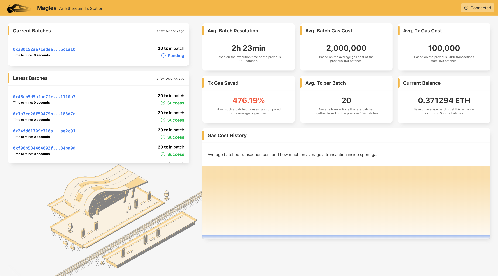

🚄🚃🚃🚃🚃🚃🚃🚃🚃🚃🚃🚃🚃🚃💨

# Maglev

Maglev is a Smart Contract batching hub that batches transactions into a single transaction in order to reduce the overall gas usage.

We call it the Tx Station, as it puts all transactions on the same train and sends them in the most efficient way that saves the initial gas cost used by up to 30%.

It was originally developed on the ETHBerlinzwei 2019 Hackathon by members of [Tenderly](https://tenderly.co). 

Check us out on [DevPost](https://devpost.com/software/maglev-ethereum-tx-station)!

 
